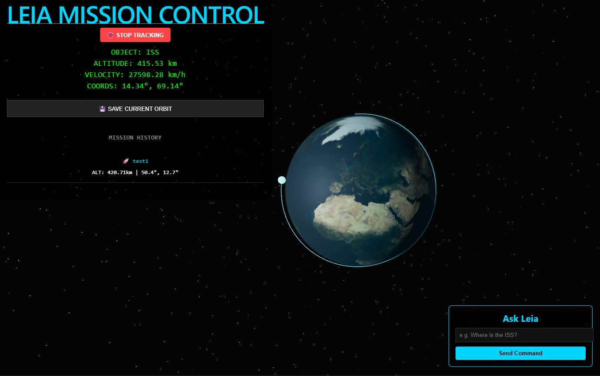
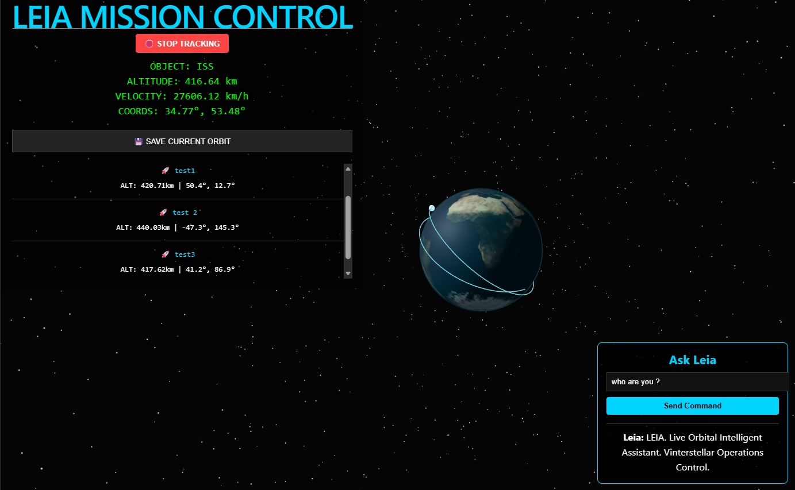
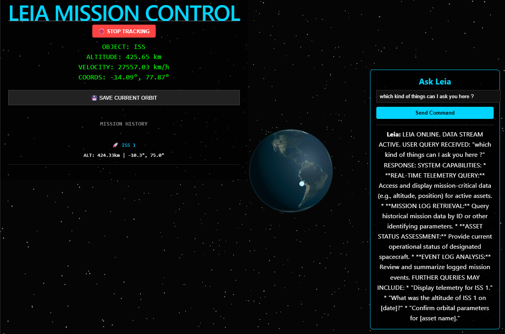

# LEIA Mission Control 🛰️

A production-ready, full-stack 3D orbital visualization platform and autonomous telemetry assistant built for the **Vinterstellar** aerospace initiative. Leia interfaces directly with real-time tracking streams, logs mission coordinates into a relational persistent layer, and leverages a localized Retrieval-Augmented Generation (RAG) AI co-pilot.

---
## 🖥️ Mission Interface Preview

| Global Telemetry View | Data-Aware AI Agent Console & Telemetry | Data-Aware AI Agent Console |
| --- | --- | --- |
|  |  |  |

---

## 🛠️ System Architecture & Data Loop

The ecosystem relies on three independent layers containerized for scale:

1. **The Core Web Dashboard (Frontend):** React + Vite executing a declarative 3D viewport canvas powered by Three.js (`@react-three/fiber`). It converts spherical earth parameters into Cartesian orbital planes.
2. **The Asynchronous Telemetry Server (Backend):** FastAPI managing asynchronous multi-service IO operations, serving math endpoints, and interacting with external telemetry data brokers.
3. **The Intelligent Agent Subsystem (AI & Data):** An optimized execution pipeline that queries an underlying SQLite database via SQLAlchemy, compiles the historical logs into an architectural prompt matrix, and runs contextual reasoning queries using the `google-genai` SDK.

---

## 🚀 Core Features

- **Real-Time Telemetry Synchronization:** Asynchronous pooling hooks stream active positional metrics from the International Space Station (ISS).
- **Dynamic 3D Orthogonal Mapping:** Interactive WebGL viewport displaying satellite orbits, dynamic atmosphere scaling, and telemetry path retention.
- **Relational Session Ledger:** One-click coordinate snapshot logging into a secure localized SQLite runtime database.
- **Space Situational Awareness (SSA) Simulation Engine:** On-demand generation of synthetic orbital cascade scenarios executing dynamic secondary collision tracking and non-linear decay curves.
- **Physics-Informed AI Weights Inference:** Pre-trained and calibrated neural network hidden layers configured to calculate sub-50ms spatiotemporal intensity vectors without falling back to static numerical safe-modes.
- **Context-Aware AI Co-Pilot (RAG):** An integrated Gemini agent capable of reading active database schemas to calculate data properties, explain mission parameters, and analyze log trends.

---

## 📐 The Mathematical Framework

The core engine transforms Earth-Centered, Earth-Fixed (ECEF) global coordinates into a Three.js coordinate grid ($X, Y, Z$) around a normalized sphere where $R_{Earth} = 1$:

$$Radius = 1 + \left(\frac{Altitude}{6371}\right)$$
$$X = -Radius \cdot \cos(\theta) \cdot \cos(\phi)$$
$$Y = Radius \cdot \sin(\theta)$$
$$Z = Radius \cdot \cos(\theta) \cdot \sin(\phi)$$

*Where $\theta$ represents the Geodetic Latitude radian value, and $\phi$ represents the Geodetic Longitude radian value.*

---

## 🛰️ Production Deployment Metrics
Backend Host: Deployed via Docker Container runtimes to cloud platforms.
Frontend Core: Static optimization tree bundles delivered through Global Content Delivery Networks (CDNs).

---
## 📦 Local Setup & Deployment

### Backend Infrastructure (FastAPI)
Navigate to the root directory and establish a localized virtual environment:

``` Bash
cd leia-mission-control
python3 -m venv venv
source venv/bin/activate
pip install -r requirements.txt
Configure your .env key mapping file:

uvicorn app.main:app --reload --host 0.0.0.0 --port 8000
Frontend Dashboard (React + Vite)
Open a separate terminal shell, navigate to the user interface directory,
and initialize the Node dependencies:

npm install
npm run dev
The system will dynamically switch its communication broker profiles
depending on your system environments (localhost:8000 or production endpoints).

----

## 🗺️ System Blueprint & Data Flow
+---------------------------------------------------------------------------------+
|                               1. FRONTEND LAYER                                 |
|   - Framework: React (Vite) + @react-three/fiber (Three.js WebGL binding)        |
|   - Telemetry Loop: Event-driven state updates polling endpoints every 2000ms   |
|   - Context Mapping: Transforms spherical Geo-data into 3D space vectors       |
+---------------------------------------------------------------------------------+
                                      |         ^
                 Axios HTTP Payload  |         |  JSON Hydration Stream
                 (POST/GET Routes)   |         |  (3D Matrix / RAG Responses)
                                      v         |
+---------------------------------------------------------------------------------+
|                               2. BACKEND LAYER                                  |
|   - Engine: FastAPI (Python) Asynchronous Server Core                           |
|   - Security Layer: Custom CORSMiddleware handling sandbox/production origins   |
|   - Network: Async client fetching telemetry maps from external space APIs     |
+---------------------------------------------------------------------------------+
                                |                 |
         SQLAlchemy ORM Model   |                 | Injected Prompt Structure 
         Session Executions     |                 | (SQLite Context + User String)
                                v                 v
+-------------------------------+   +---------------------------------------------+
|    3. PERSISTENCE ENGINE      |   |             4. CO-PILOT ENGINE              |
|   - DB: SQLite Binary Stack   |   |   - Ecosystem: google-genai SDK             |
|   - Model: Mission Registry   |   |   - Neural Core: gemini-2.5-flash           |
|   - Storage: Relational Logs  |   |   - Strategy: In-Memory RAG Engine          |
+-------------------------------+   +---------------------------------------------+
